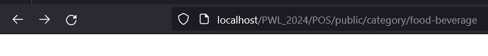
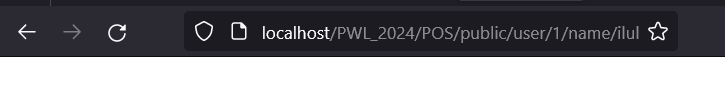
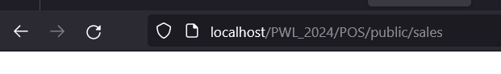

### Soal Praktikum

3. 
a. Halaman Home  
  
b. Halaman Products  
  
c. Halaman User  
  
d. Halaman Penjualan  

    Isi dari halamannya kosong karena pada directory view nya tidak ada datanya maka tidak ada data yang ditampilkan.

4.  Kodingan Routing  

        Route::get('/', [HomeController::class, 'index']);

        Route::prefix('category')->group(function () { 
        Route::get('/food-beverage', [ProductController::class, 'foodBeverage']);
        Route::get('/beauty-health', [ProductController::class, 'beautyHealth']);
        Route::get('/home-care', [ProductController::class, 'homeCare']);
        Route::get('/baby-kid', [ProductController::class, 'babyKid']);  
        });

        Route::get('/user/{id}/name/{name}', [UserController::class, 'show']);

        Route::get('/sales', [SaleController::class, 'index']);

5.  Kodingan Fungsi  

            class HomeController extends Controller  
            {
            public function index()
            {
            return view('home');
            }
            }

            class ProductController extends Controller  
            {
            public function beautyHealth()
            {
            return view('products.index');
            }

            public function homeCare()
            {
            return view('products.index');
            }

            public function babyKid()
            {
            return view('products.index');
            }
            public function foodBeverage()
            {
            return view('products.index');
            }
            }

            class SaleController extends Controller  
            {
            public function index()
            {
            return view('sale');
            }
            }

            class UserController extends Controller  
            {
            public function show($id, $name)
            {
            return view('user', compact('id', 'name'));
            }  
            }