## Laporan JOBSHEET 02 ROUTING, CONTROLLER, DAN VIEW

NIM : 2241720033  
Nama : Mochammad Cholilur Rokhman  
Kelas : TI-2F

### BASIC ROUTING

#### Langkah Langkah Praktikum

1. Route Hello  
   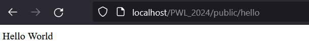

2. Route World  
   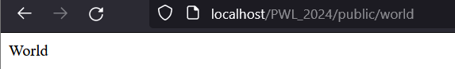

3. Route Selamat datang  
   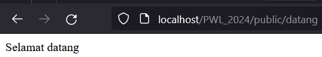

4. Route About  
   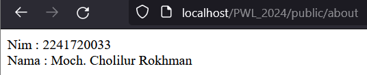

### Route Parameters

#### Langkah Langkah Praktikum

b. 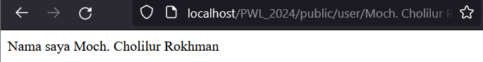

c. 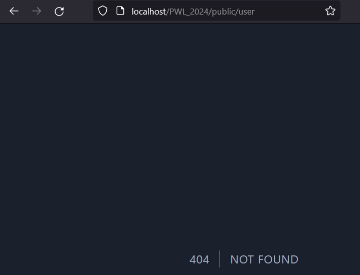

e. 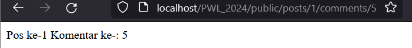

f. Route::get('/articles{id}', function ($id) {
echo "Halaman Artikel dengan ID $id";
});  
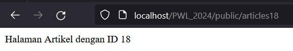

### Operational Parameters

#### Langkah Langkah Praktikum

b. 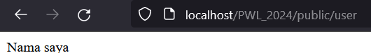
c. 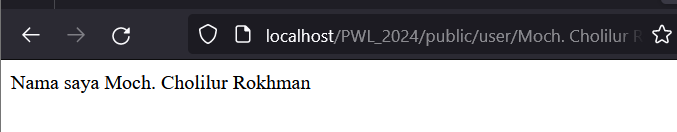
e. 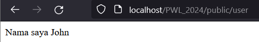

### Controller (Membuat Controller)

#### Langkah Langkah Praktikum

e. 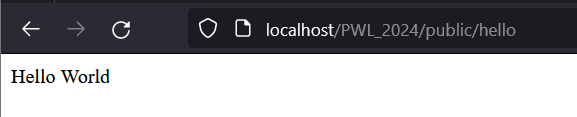 
f. class PageController extends Controller
{
    public function index ()
    {
        return 'Selamat Datang';
    }

    public function about()
    {
        $nim = '2241720033';
        $nama = 'Moch. Cholilur Rokhman';

        return 'NIM : ' . $nim . ' ' .
               'Nama : ' . $nama;
    }
    public function articles($id)
    {
        return 'Halaman Artikel dengan Id ' . $id;
    }

};

    Untuk Routingnya 
    Route::get('/', [PageController::class, 'index']);
    Route::get('/about', [PageController::class, 'about']);
    Route::get('/articles{id}', [PageController::class, 'articles']);

g.  Routing nya  
    Route::get('/', [HomeController::class, "index"]);  
    Route::get('/about', [AboutController::class, 'About']);  
    Route::get('/articles{id}', [ArticleController::class, 'articles']);

###  Resource Controller

#### Langkah Langkah Praktikum

 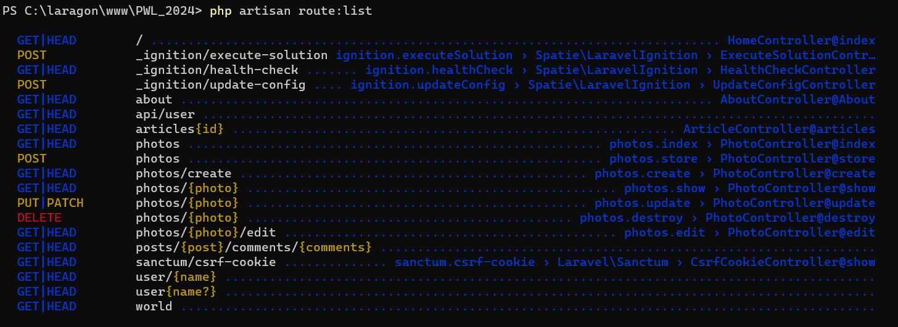 

###  View (Membuat View)

#### Langkah Langkah Praktikum

c.  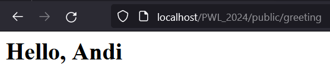 

###  View dalam direktori

#### Langkah Langkah Praktikum

c.   

###  Menampilkan View dari Controller 

#### Langkah Langkah Praktikum

c.   

###  Meneruskan data ke View

#### Langkah Langkah Praktikum

c.  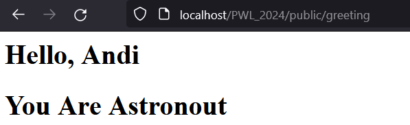 

### Soal Praktikum

 Untuk File nya berada didalam direktori PWL_2024/POS  
3. a. Halaman Home  
        
   b. Halaman Products  
       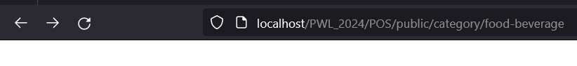 
   c. Halaman User  
       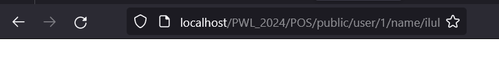 
   d. Halaman Penjualan  
       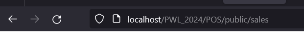 

    Isi dari halamannya kosong karena pada directory view nya tidak ada datanya maka tidak ada data yang ditampilkan.
4. Kodingan Route  
    Route::get('/', [HomeController::class, 'index']);

    Route::prefix('category')->group(function ()  { 
        Route::get('/food-beverage', [ProductController::class, 'foodBeverage']);
        Route::get('/beauty-health', [ProductController::class, 'beautyHealth']);
        Route::get('/home-care', [ProductController::class, 'homeCare']);
        Route::get('/baby-kid', [ProductController::class, 'babyKid']);  
    });

    Route::get('/user/{id}/name/{name}', [UserController::class, 'show']);

    Route::get('/sales', [SaleController::class, 'index']);

5. Kodingan Fungsi  
    class HomeController extends Controller  
    {
    public function index()
    {
    return view('home');
    }
    }

    class ProductController extends Controller  
    {
    public function beautyHealth()
    {
    return view('products.index');
    }

    public function homeCare()
    {
    return view('products.index');
    }       

    public function babyKid()
    {
    return view('products.index');
    }
    public function foodBeverage()
    {
    return view('products.index');
    }
    }

    class SaleController extends Controller  
    {
    public function index()
    {
    return view('sale');
    }
    }

    class UserController extends Controller  
    {
  public function show($id, $name)
    {
    return view('user', compact('id', 'name'));
    }  
    }

